# User roled RBAC  (role based access)

| Role                 | Read User Data | Write User Data | Read External Data | Write External Data | Delete User Data |
| -------------------- | -------------- | --------------- | ------------------ | ------------------- | -------------- |
| User                 | Own data only  | Own data only   | Yes                | No                  | No           |
| Developer / Admin    | All            | All             | No                | All                 | Yes           |
| External Data Source | No             | No              | Yes (Orgs can see their own databases)                | Yes (orgs can update their databases)     | No             |

```mermaid
flowchart TD
    %% Roles
    User["User"]
    DevAdmin["Developer / Admin"]
    External["External Data Source"]

    %% permissions for User
    logMeals["log meals"]
    viewMeals["view meals"]
    trackReactions["track  reactions"]
    viewReactionReports["view reaction reports"]
    editProfile["edit their profile"]

    %% permissions for Dev/Admin
    createRoles["create/modify access roles"]
    accessUserData["access user data"]
    manageDB["manage database connections"]
    updateCode["update app features/code"]
    readWriteData["read/write all data"]

    %% permissions for External Data Source
    provideFoodInfo["provide food/nutrient info (read-only for users and developers)"]
    feedDBUpdates["feed their own external database updates"]
    noUserMod["cannot modify user data"]

    %% Connections
    User --> LogMeals
    User --> viewMeals
    User --> trackReactions
    User --> viewReactionReports
    User --> editProfile

    DevAdmin --> createRoles
    DevAdmin --> accessUserData
    DevAdmin --> manageDB
    DevAdmin --> updateCode
    DevAdmin --> readWriteData

    External --> provideFoodInfo
    External --> feedDBUpdates
    External --> noUserMod

```

