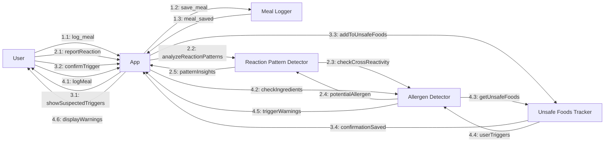

# Communication diagram

```mermaid
graph LR
    U[User] -- 1.1: log_meal --> TB[App]
    TB -- 1.2: save_meal --> ML[Meal Logger]
    ML -- 1.3: meal_saved --> TB
    
    U -- 2.1: reportReaction --> TB
    TB -- 2.2: analyzeReactionPatterns --> RD[Reaction Pattern Detector]
    RD -- 2.3: checkCrossReactivity --> AD[Allergen Detector]
    AD -- 2.4: potentialAllergen --> RD
    RD -- 2.5: patternInsights --> TB
    
    TB -- 3.1: showSuspectedTriggers --> U
    U -- 3.2: confirmTrigger --> TB
    TB -- 3.3: addToUnsafeFoods --> UF[Unsafe Foods Tracker]
    UF -- 3.4: confirmationSaved --> TB
    
    U -- 4.1: logMeal --> TB
    TB -- 4.2: checkIngredients --> AD
    AD -- 4.3: getUnsafeFoods --> UF
    UF -- 4.4: userTriggers --> AD
    AD -- 4.5: triggerWarnings --> TB
    TB -- 4.6: displayWarnings --> U

   %%Note: Cross-reactivity (step 2.3) only applies to protein-based allergens, not FODMAPs

```
  
