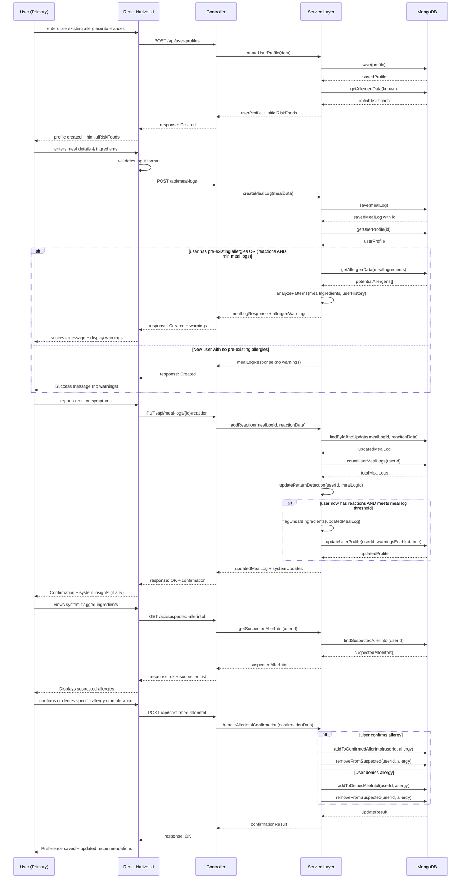

# Sequence Diagram

## User Meal log interaction

```mermaid
sequenceDiagram
    participant U as User (Primary)
    participant UI as React Native UI
    participant C as Controller
    participant S as Service Layer
    participant DB as MongoDB

    
    U->>UI: enters pre existing allergies/intolerances
    UI->>C: POST /api/user-profiles
    
    C->>S: createUserProfile(data)
    S->>DB: save(profile)
    DB-->>S: savedProfile
    
    S->>DB: getAllergenData(known)
    DB-->>S: initialRiskFoods
    S-->>C: userProfile + initialRiskFoods
    C-->>UI: response: Created
    UI-->>U: profile created + hinitialRiskFoods

    
    U->>UI: enters meal details & ingredients
    UI->>UI: validates input format
    UI->>C: POST /api/meal-logs
    
    C->>S: createMealLog(mealData)
    S->>DB: save(mealLog)
    DB-->>S: savedMealLog with id
    
    S->>DB: getUserProfile(id)
    DB-->>S: userProfile
    
    alt user has pre-existing allergies OR (reactions AND min meal logs)
        S->>DB: getAllergenData(mealIngredients)
        DB-->>S: potentialAllergens[]
        S->>S: analyzePatterns(mealIngredients, userHistory)
        S-->>C: mealLogResponse + allergenWarnings
        C-->>UI: response: Created + warnings
        UI-->>U: success message + display warnings
    else New user with no pre-existing allergies
        S-->>C: mealLogResponse (no warnings)
        C-->>UI: response: Created
        UI-->>U: Success message (no warnings)
    end
    
    
    U->>UI: reports reaction symptoms
    UI->>C: PUT /api/meal-logs/{id}/reaction
    C->>S: addReaction(mealLogId, reactionData)
    S->>DB: findByIdAndUpdate(mealLogId, reactionData)
    DB-->>S: updatedMealLog
    
    S->>DB: countUserMealLogs(userId)
    DB-->>S: totalMealLogs
    
    S->>S: updatePatternDetection(userId, mealLogId)
    
    alt user now has reactions AND meets meal log threshold
        S->>S: flagUnsafeIngredients(updatedMealLog)
        S->>DB: updateUserProfile(userId, warningsEnabled: true)
        DB-->>S: updatedProfile
    end
    
    S-->>C: updatedMealLog + systemUpdates
    C-->>UI: response: OK + confirmation
    UI-->>U: Confirmation + system insights (if any)

    
    U->>UI: views system-flagged ingredients
    UI->>C: GET /api/suspected-allerintol
    C->>S: getSuspectedAllerIntol(userId)
    S->>DB: findSuspectedAllerIntol(userId)
    DB-->>S: suspectedAlleIntols[]
    S-->>C: suspectedAllerIntol
    C-->>UI: response: ok + suspected list
    UI-->>U: Displays suspected allergies
    
    U->>UI: confirms or denies specific allergy or intolerance
    UI->>C: POST /api/confirmed-allerintol
    
    C->>S: handleAllerIntolConfirmation(confirmationData)
    alt User confirms allergy
        S->>DB: addToConfirmedAllerIntol(userId, allergy)
        S->>DB: removeFromSuspected(userId, allergy)
    else User denies allergy
        S->>DB: addToDeniedAlleIntol(userId, allergy)
        S->>DB: removeFromSuspected(userId, allergy)
    end
    DB-->>S: updateResult
    
    S-->>C: confirmationResult
    C-->>UI: response: OK
    UI-->>U: Preference saved + updated recommendations
```
